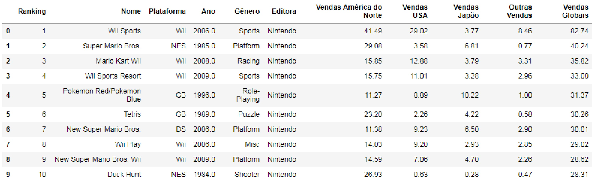
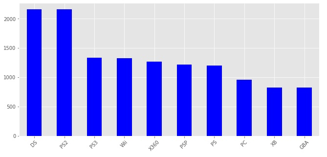
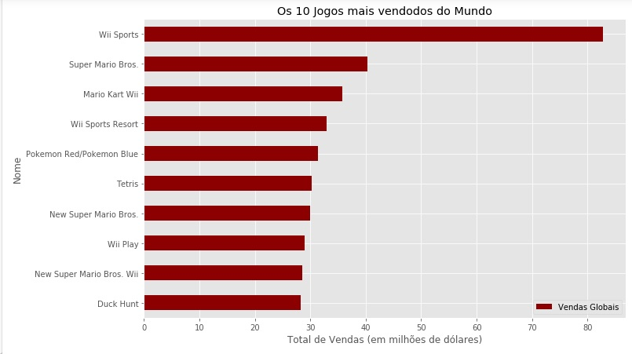
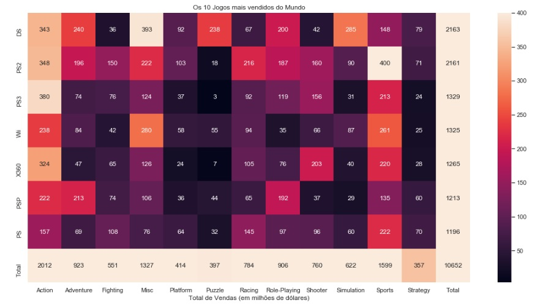

# Data Science no mercado internacional de videogames

  

Através do uso de Data Science, o presente artigo objetiva  estabelecer correlações entre a quantidade de jogos de videogames produzidos nas últimas décadas e sua penetração no mercado consumidor, atrvés do levantamento do número de unidades vendidas.

## Utilidade mercadológica

Com as informações de 182.576 dados de comercialização sobre diferentes plataformas de jogos, pode-se projetar e otimizar a utilização de diferentes estratégias de lançamentos de produtos, desenvolvimento de software, marketing aplicável e prospecção de novos mercados. 

  

## 10 Jogos mais comercializados desde 1984

Abaixo realizamos uma primeira inferência sobre os 10 jogos mais vendidos desde o ano 1984. 
Chama atenção o fato de 30% desses terem sido lançados ainda na década de 80, quando a tecnologia ainda era incipiente. Analogamente, outros 60% começaram a ser vendidos na primeira década do século 2.000. Esses dados demonstram que as significativas inovações em enganheria de software mais recentes, não foram suficientes para alavamcar grandes volumes de venda. Além disso, existe uma predileção dos jogadores por manter o tradicionalismo da preservação de coleções atemporais.

  

# A distinção entre as Plataformas

Torna-se de vital importância estatística averiguar quais plataformas de fabricação de jogos conseguiram lançar as unidades que obtiveram o maior número vendas realizadas em mercado, para que se possa constatar quais são, de fato, as de maior efetividade em relação à inovação.
Pode-se constatar que as mais importantes plataformas são o Nintendo DS e o Play Station 2, que mostram-se empatados na tabela abaixo com cerca de 2.250 unidades lançadas cada.

## 10 Maiores Plataformas

  

# Quais são os 10 jogos mais vendidos da história dos games e o que eles nos dizem?

Com uma liderança incontestável, o que pode concretamente apontar uma direção inequívoca para novos lançamentos, observa-se o Nitendo Wii Sports, como o jogo com a maior arrecadação de vendas na história dos jogos.
Constata-se dessa forma, uma significativa predileção dos usuários por jogos na área esportiva e assuntos relacionados.
A segunda colocação, ocupada pelo tradicional Super Mario, faz reforçar a percepção de que o público é ávido por jogos dinãmicos, uma vez que o tradicional personagem também possui uma vertente de muita aventura em sey contexto.
Os resultados podem ser averiguados de acordo com o levantamento realizado na tabela abaixo.

## 10 Maiores Jogos em termos de arrecadação

  

# Gráfico de Calor: Realização de Arrecadação com os Jogos, por Plataforma e Área de Interesse

Usando um arrojado Gráfico de calor, pode-se confirmar a esperada prevalência dos jogos de ação e esportes no faturamento obtido. A partir desse gráfico, pode-se realizar também inúmeras observações, como por exemplo, que jogos de corrida, exceto os das plataformas PS e PS2, não têm histórico de possuir bom desempenho comercial. Outra área com desempenho muito abaixo da média, são os jogos de estratégia, o que possivelmente vai indicar uma reduzida tendência pelas plataformas, de realizarem lançamentos nessas áreas. 

# Realização de Faturamento

  

